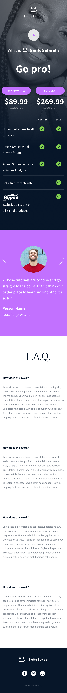

# 0x0F. Build a web app in JavaScript

In this project, you will finalize the previous project 0x0B. Implement a design with bootstrap and make some parts dynamic with Javascript (JQuery exactly).

You will reuse final files of 0x0B. Implement a design with bootstrap and update them.

You will use all HTML/CSS/Accessibility/Responsive design/Bootstrap/Javascript knowledges that you learned previously.

You won’t have a lot of instruction, you are free to implement it the way that you want - the objective is simple: Have fully functional web pages that look the same as the designer file.

Here the final result:

## Desktop

## Tablet

## Mobile

---

## Author:

- Juan Pablo Yepes Tamayo